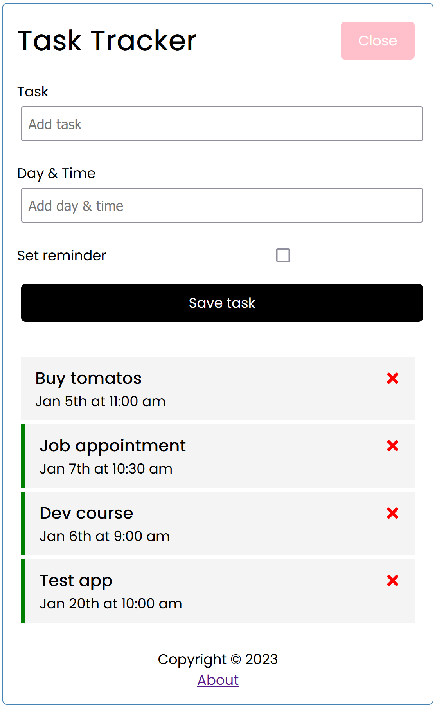
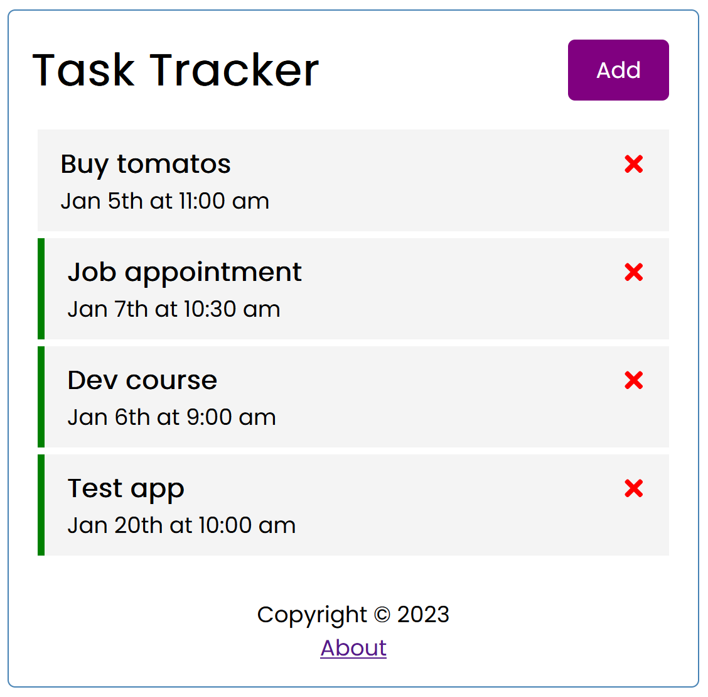
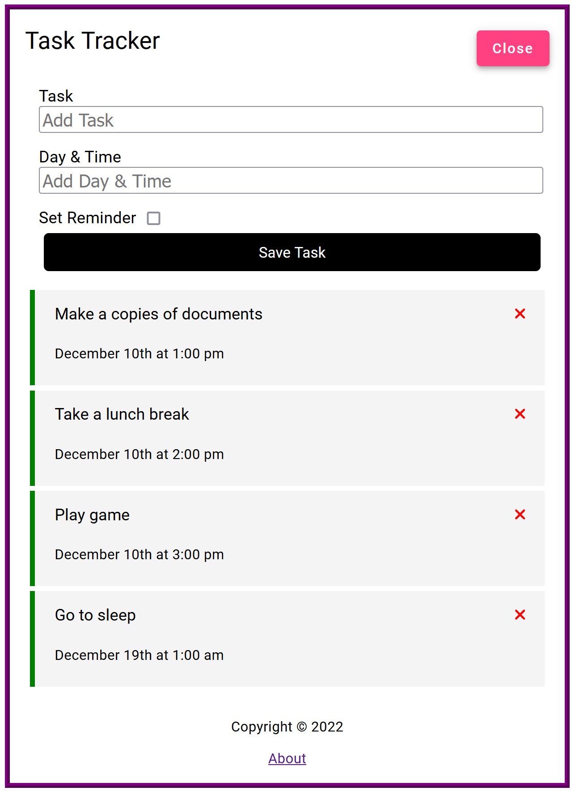
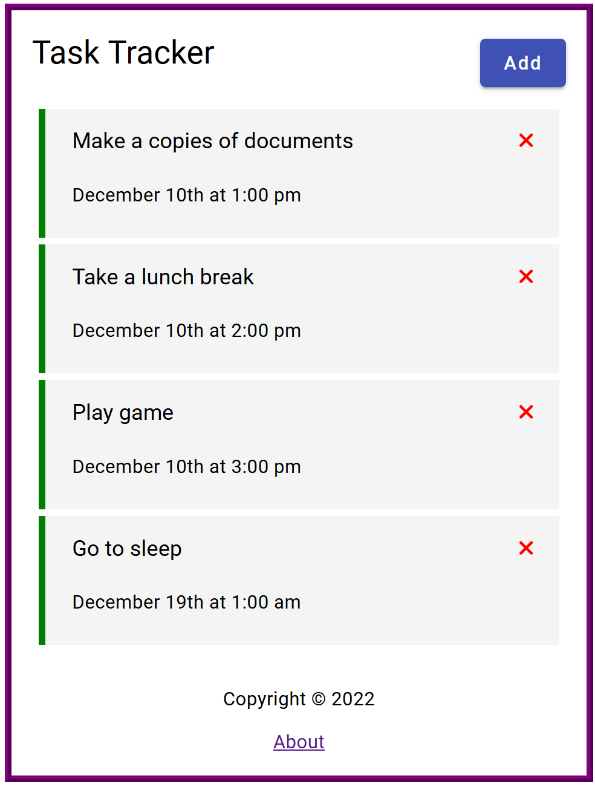

# Task Manager

<!-- TABLE OF CONTENTS -->
<details>
  <summary>Table of Contents</summary>
  <ol>
    <li>
      <a href="#about-the-project">About The Project</a>
      <ul>
        <li><a href="#built-with">Built With</a></li>
      </ul>
    </li>
    <li>
      <a href="#getting-started">Getting Started</a>
      <ul>
        <li><a href="#prerequisites">Prerequisites</a></li>
        <li><a href="#installation">Installation</a></li>
      </ul>
    </li>
    <li><a href="#usage">Usage</a></li>
  </ol>
</details>

<!-- ABOUT THE PROJECT -->
## About The Project

1. React version <br><br>
 

2. Angular version <br><br>
 

Task manager allows you:
* to read list of tasks from back-end server.
* to create/update new task via front-end form.
* to remove task from back-end server.

Use the `README.md` to get started.

<p align="right">(<a href="#readme-top">back to top</a>)</p>

### Built With

Full-stack app is based on two different front-end frameworks:

[![React][React.js]][React-url] in folder `react`.

[![Angular][Angular.io]][Angular-url] in folder `angular`.

Back-end server is done with [json-server](https://www.npmjs.com/package/json-server)

[![RestfulAPI][Restfulapi.net]][Restfulapi-url]

Another frameworks/libraries used in project:

[![Bootstrap][Bootstrap.com]][Bootstrap-url]
[![Typescript][Typescriptlang.org]][Typescript-url]

<p align="right">(<a href="#readme-top">back to top</a>)</p>


<!-- GETTING STARTED -->
## Getting Started

### Prerequisites

* npm
  ```sh
  npm install npm@latest -g
  ```

### Installation

1. Clone the repo
   ```sh
   git clone https://github.com/yarski25/task-manager.git
   ```
2. Install NPM packages
   ```sh
   npm install
   ```
3. Run back-end server
   ```sh
   npm run server
   ```
   
   _to change default port just change `package.json`_ 
   ```js
   "server": "json-server --watch db.json --port 5000"
   ```
4. Run front-end
   ```sh
   npm start
   ```
   
   _to change default port just change `package.json`_
   ```js
   "start": "react-scripts start --port 3000"
   ```
5. Enjoy task manager :smile:

<p align="right">(<a href="#readme-top">back to top</a>)</p>

<!-- MARKDOWN LINKS & IMAGES -->
<!-- https://www.markdownguide.org/basic-syntax/#reference-style-links -->
[Next.js]: https://img.shields.io/badge/next.js-000000?style=for-the-badge&logo=nextdotjs&logoColor=white
[Next-url]: https://nextjs.org/
[React.js]: https://img.shields.io/badge/React-20232A?style=for-the-badge&logo=react&logoColor=61DAFB
[React-url]: https://reactjs.org/
[Angular.io]: https://img.shields.io/badge/Angular-DD0031?style=for-the-badge&logo=angular&logoColor=white
[Angular-url]: https://angular.io/
[Bootstrap.com]: https://img.shields.io/badge/Bootstrap-563D7C?style=for-the-badge&logo=bootstrap&logoColor=white
[Bootstrap-url]: https://getbootstrap.com
[Typescriptlang.org]: https://img.shields.io/badge/typescript-3399FF?style=for-the-badge&logo=typescript&logoColor=white
[Typescript-url]: https://www.typescriptlang.org/
[Restfulapi.net]: https://img.shields.io/badge/Rest-api-20232A?style=for-the-badge&logo=rest-api&logoColor=61DAFB
[Restfulapi-url]: https://restfulapi.net/
